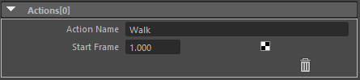

.. _attr_Action_en:

Action List
###########

.. contents:: Contents of this page:
   :depth: 3
   :local:

++++

Overview
********

* This attribute does not directly affect the view
* Can be combined with Python or MEL scripts to customize the view

  * This attribute is intended to be used when creating animation clips for games.

.. seealso::
  * See [:ref:`sample_Action_en`] for specific usage

++++

Attributes
**********

.. figure:: ../../_images/actionAttr1.png
   :alt: actionAttr1

[Add New Item] button
=====================

* Add an Action item

++++

Attributes (Actions[*] in frame)
********************************

Action Name
===========

* Enter an action name

  * ``Walk`` ``Jump`` etc.

Start Frame
===========

* Enter the start frame of the action

End Frame
===========

* Enter the end frame of the action

"Trash" icon
============

* Delete Actions[*]

.. _Issues: https://github.com/PluginMania/RenderOverrideForMaya/issues
