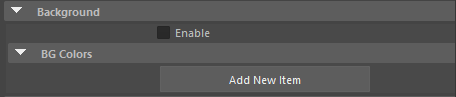
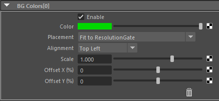

.. _attr_Background_en:

Background
##########

.. contents:: Contents of this page:
   :depth: 3
   :local:

++++

Overview
********

* Images can be displayed in back of 3D objects
* If the texture has an embedded alpha channel, it will be treated as transparent
* Multiple images can be stacked on top of each other

.. figure:: ../../_gif/_tmp_gif.gif
   :alt: bgOverview

.. _bg_texture_note_en:

Notes for applying textures
============================

.. note::
   * Connect the file node directly to the ``Color`` attribute
   * Color correction effects such as ``Color Space`` in the file node will be disabled.

     * Prepare sequentially numbered material with baked LUTs, etc.
     * However, it is affected by the view's ``View Transform``.

++++

Attribute
*********

Enable
======

* Controls on/off of the entire background

[Add New Item] button
=====================

* Add Background items

++++

Attribute (BG Colors[*] in frame)
*********************************

Enable
======

* On/off for each Background
* Can be disabled individually

Color
=====

* Background color
* :ref:`Notes for applying textures <bg_texture_note_en>`.

Placement
=========

* **Fit to ResolutionGate**

  * Displays images according to ResolutionGate's height and width
  * If the aspect ratio of the image and ResolutionGate are different, the image is adjusted to fit the ResolutionGate.

* **Fit to Letterbox**

  * The image will be adjusted to fit the Letterbox aspect ratio
  * If the aspect ratio of the image and Letterbox are different, the image will be adjusted to fit the Letterbox

* **Ctrl by params [ResolutionGate align]**

  * Scale or offset the position of an image aligned on the ResolutionGate
  * Image aspect ratio is preserved

* **Ctrl by params [Letterbox align]**

  * Scale or offset the position of an aligned image in the letterbox
  * Image aspect ratio is preserved

* **Ctrl by params [View align]**

  * Scale or offset the position of an aligned image in the viewport
  * Image aspect ratio is preserved

Alignment
=========

* Available only when the following items of the ``Placement`` attribute are selected

  * ``Ctrl by params [ResolutionGate align]``
  * ``Ctrl by params [Letterbox align]``
  * ``Ctrl by params [View align]``

* Specifies where in the reference box (``ResolutionGate`` , ``Letterbox`` , ``View``) to be aligned.

  * It can also be used as a pivot when multiplying an image by Scale

  +-------------+-----------------+--------------+
  | Alignment (Attribute Value)                  |
  +=============+=================+==============+
  | Top Left    | Top Center      | Top Right    |
  +-------------+-----------------+--------------+
  | Center Left | Center          | Center Right |
  +-------------+-----------------+--------------+
  | Bottom Left | Bottom Center   | Bottom Right |
  +-------------+-----------------+--------------+

Scale
=====

* Available only when the following items of the ``Placement`` attribute are selected

  * ``Ctrl by params [ResolutionGate align]``
  * ``Ctrl by params [Letterbox align]``
  * ``Ctrl by params [View align]``

* Scales the image around the alignment specified by the ``Alignment`` attribute.

Offset X (%), Offset Y (%)
==========================

* Available only when the following items of the ``Placement`` attribute are selected

  * ``Ctrl by params [ResolutionGate align]``
  * ``Ctrl by params [Letterbox align]``
  * ``Ctrl by params [View align]``

* Offsets the image position vertically and horizontally.
* The value is a percentage of the length and width of the reference box (``ResolutionGate`` , ``Letterbox`` , ``View``).

"Trash" icon
============

* Remove the BG Color
* Use the ``Enable`` attribute to temporarily hide it
