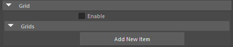
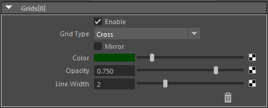

.. _attr_Grid_en:

Grid
#####

.. contents:: Contents of this page:
   :depth: 3
   :local:

++++

Overview
********

* Display a grid within the ResolutionGate (or within the letterbox when the letterbox is displayed).
* "Phi Grid" and other commonly used grids are available
* Multiple grids can be displayed in combination.

.. figure:: ../../_gif/_tmp_gif.gif
   :alt: gridOverview

++++

Attributes
**********

Enable
======

* Controls on/off of the entire Grid

[Add New Item] button
=====================

* Add an item to the grid

++++

Attributes (Grids[*] in frame)
******************************

Enable
======

* On/off for each Grid
* Can be disabled individually

Grid Type
=========

* The grid below is provided.
* The grid can be inverted with the ``Mirror`` attribute.

  .. figure:: ../../_images/grid_list_v002.svg
     :alt: gridList

     (The blue dashed line in the figure is an auxiliary line (it indicates the location of the line's vertex and is not drawn)).
     To enlarge the image, right-click on the image and follow the menu "Open image in new tab".

Mirror
======

* Flip the grid.
* (Most grids are flipped left to right, but some grids are flipped up or down)

Color
=====

* Grid color
* (Even if a texture is connected, it will be displayed in a single color)

Opacity
=======

* Grid opacity
* (Even if textures are connected, Opacity is applied uniformly)

Line Width
==========

* Grid Width
* (Even if textures are connected, Line Width is applied uniformly)

"Trash" icon
============

* Remove the grid
* Use the ``Enable`` Attribute to temporarily hide it

++++

Precautions (Known Issues)
**************************

When multiple Grids are set, some of them are not displayed.
============================================================

* The following two grids will not be drawn unless specified at the beginning

  * ``Golden Spiral(A)``
  * ``Golden Spiral(B)`` (Mirror)

  .. figure:: ../../_images/gridTroubleA.png
     :alt: gridTroubleA

     (``Golden Spiral(A)`` is set to second, so it will not appear in the view)

* The reason is that the drawing process is different from other Grids.
* Please change the order of Grid drawing.

  .. figure:: ../../_images/gridTroubleB.png
     :alt: gridTroubleB

     (If ``Golden Spiral(A)`` is specified at the beginning, it will be displayed in the view.)

