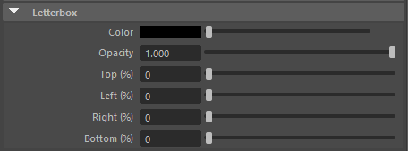

.. _attr_Letterbox_en:

Letterbox
#########

.. contents:: Contents of this page:
   :depth: 3
   :local:

++++

Overview
********

* Letterboxes can be displayed on the top, bottom, left, and right
* The standard for displaying the borders is ResolutionGate.
* The thickness of the letterbox is calculated based on the resolution value in RenderSettings

  * For example, to display a letterbox in the top 10% of a ResolutionGate of 1000px height, set the **Top** attribute to ``100`` (px)

.. figure:: ../../_gif/_tmp_gif.gif
   :alt: letterbox

++++

Attributes
**********

Color
=====

* Letterbox Color

Opacity
=======

* Letterbox opacity

Top (px)
=========

* Specify the height of the letterbox to be displayed at the top

Left (px)
==========

* Specify the width of the letterbox to be displayed on the left side

Right (px)
===========

* Specify the width of the letterbox to be displayed on the right side

Bottom (px)
============

* Specify the height of the letterbox to be displayed at the bottom.

.. seealso::
   See ":ref:`sample_letterbox_en`" for concrete examples of how to use it.
