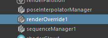

.. _RenderOverrideNode_en:

Render Override Node
####################

.. contents:: Contents of this page:
   :depth: 2
   :local:

++++

Overview
********

When RenderOverride is activated, basic information (text) is displayed, but for more detailed control, create a ``RenderOverride node`` and set various attributes

Create RenderOverride node
**************************

* Method1

  1. From Shelf, click on the **NodeEditor** icon to launch the editor

     .. figure:: ../../_images/shelf_editor_icon.png
        :alt: shelf_editor_icon

  2. Click the ``Create RenderOverride Node`` button to create a node

     .. figure:: ../../_images/NodeEditorAll.jpg
        :alt: NodeEditorAll

* Method2

  * Run the following MEL command

    .. code-block:: c++

       createNode "renderOverride";

How to verify that a node has been created
******************************************

* Confirm that a RenderOverride node (DG node) has been created

  * **Outliner**

    .. figure:: ../../_images/outlinerFindNode.png
       :alt: outlinerFindNode

    * In Outliner, uncheck ``Display > DAG Objects Only`` in the menu

      .. figure:: ../../_images/outlinerMenu.png
         :alt: outlinerMenu

  * **NodeEditor**

    .. figure:: ../../_images/NodeEditorAll.jpg
       :alt: NodeEditorAll

       The created node will appear in the list of nodes in NodeEditor.

.. important::

   * Multiple RenderOverride nodes can be created in a Maya scene, but only one node ("active node") is applied to the view.
   * The node applied to the view is determined as follows

     1. RenderOverride nodes in order of name
     2. In turn, check if the ``Enable`` attribute is checked.
     3. The information for the node whose ``Enable`` attribute was checked first is applied.

        * If none of the nodes have ``Enable`` checked, the default text will be displayed.

   .. sep

   * Multiple nodes can be used for different purposes, such as " **for layout** " and " **for Playblast** ".

Attributes of the RenderOverride node
*************************************

Enable
======

  .. figure:: ../../_images/attrEnable.png
     :alt: outlinerFindNode

  * If checked **on**, various settings are reflected in the view

    * If the check is **off**, it is disabled
    * If there are multiple RenderOverride nodes in the scene, the first node whose ``Enable`` is **on** will be used, in order of name.

++++

Other Attributes
====================

Other attributes can be found on a dedicated page (link below).

・ :ref:`attr_Text_en`
----------------------

・ :ref:`attr_Letterbox_en`
---------------------------

・ :ref:`attr_Grid_en`
----------------------

・ :ref:`attr_Foreground_en`
----------------------------

・ :ref:`attr_Background_en`
----------------------------

・ :ref:`attr_Action_en`
------------------------

