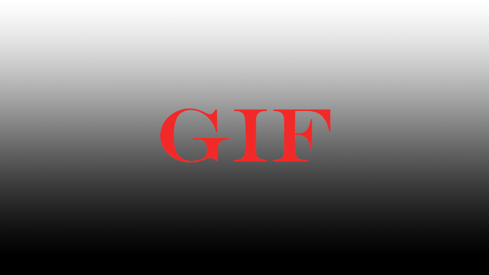

.. _attr_Foreground_jp:

フォアグラウンド
######################

.. contents:: このページの目次:
   :depth: 3
   :local:

++++

概要
*****

* 3Dオブジェクトの手前に画像を表示させることができます
* テクスチャにアルファチャンネルが埋め込まれていれば、透明処理されます
* 複数の画像を重ねることができます

.. _fg_texture_note_jp:

※テクスチャを適用させる場合の注意事項
======================================

.. note::
   * fileノードを ``Color`` アトリビュートに直接接続してください
   * fileノードの ``Color Space`` などの色調補正の効果は無効になります

     * LUTなどをベイクした連番素材を用意してください
     * 但し、ビューの ``View Transform`` の影響は受けます

++++

アトリビュート
**************

.. figure:: ../../_images/fgAttr1.png
   :alt: fgAttr1

Enable
======

* Foreground全体のon/offを制御します

Add New Item ボタン
===================

* Foregroundのアイテムを追加します

++++

アトリビュート(FG Colors[*]枠内)
********************************

Enable
======

* 各Foregroundのon/off
* 個別に無効にすることができます

Color
=====

* Foregroundのカラー
* :ref:`テクスチャを表示させる時の注意事項 <fg_texture_note_jp>`

Placement
=========

* **Fit to ResolutionGate**

  * 画像をResolutionGateの縦横幅に合わせて表示します
  * 画像とResolutionGateの縦横比が違う場合は、ResolutionGateにフィットするように調整されます

* **Fit to Letterbox**

  * 画像をLetterboxの縦横幅に合わせて表示します
  * 画像とLetterboxの縦横比が違う場合は、Letterboxにフィットするように調整されます

* **Ctrl by params [ResolutionGate align]**

  * ResolutionGateに整列した画像に対し、Scaleを掛けたり、ポジションをOffsetさせることができます
  * 画像の縦横比は保持されます

* **Ctrl by params [Letterbox align]**

  * レターボックスに整列した画像に対し、Scaleを掛けたり、ポジションをOffsetさせることができます
  * 画像の縦横比は保持されます

* **Ctrl by params [View align]**

  * ビューポートに整列した画像に対し、Scaleを掛けたり、ポジションをOffsetさせることができます
  * 画像の縦横比は保持されます

Alignment
=========

* ``Placement`` アトリビュートの、次の項目が選択されている時のみ有効

  * ``Ctrl by params [ResolutionGate align]``
  * ``Ctrl by params [Letterbox align]``
  * ``Ctrl by params [View align]``

* 基準となる枠(``ResolutionGate`` , ``Letterbox`` , ``View``)のどこに整列するか指定します

  * 画像にScaleを掛けるときのピボットにもなります

  +---------------+----------+
  | Alignment     | 整列箇所 |
  +===============+==========+
  | Top Left      | 左上     |
  +---------------+----------+
  | Top Center    | 上中央   |
  +---------------+----------+
  | Top Right     | 右上     |
  +---------------+----------+
  | Center Left   | 左中央   |
  +---------------+----------+
  | Center        | 中央     |
  +---------------+----------+
  | Center Right  | 右中央   |
  +---------------+----------+
  | Bottom Left   | 左下     |
  +---------------+----------+
  | Bottom Center | 下中央   |
  +---------------+----------+
  | Bottom Right  | 右下     |
  +---------------+----------+

Scale
=====

* ``Placement`` アトリビュートの、次の項目が選択されている時のみ有効

  * ``Ctrl by params [ResolutionGate align]``
  * ``Ctrl by params [Letterbox align]``
  * ``Ctrl by params [View align]``

* ``Alignment`` アトリビュートで指定した整列箇所を中心に、画像にスケールを掛けます

Offset X (%), Offset Y (%)
==========================

* ``Placement`` アトリビュートの、次の項目が選択されている時のみ有効

  * ``Ctrl by params [ResolutionGate align]``
  * ``Ctrl by params [Letterbox align]``
  * ``Ctrl by params [View align]``

* 画像のポジションを上下左右にオフセットします
* 数値は、基準となる枠(``ResolutionGate`` , ``Letterbox`` , ``View``)の縦横の長さに対する割合になります

"ゴミ箱"アイコン
================

* FG Colorを削除します
* 一時的に非表示にしたい場合は、 ``Enable`` アトリビュートを使用してください
