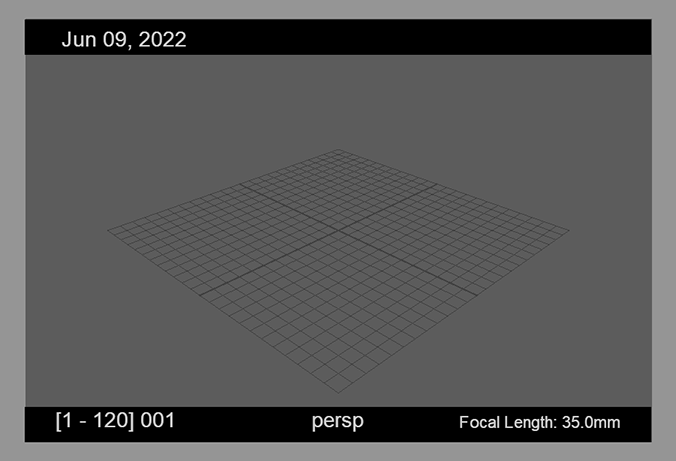

.. _attr_Letterbox_jp:

レターボックス
######################

.. contents:: このページの目次:
   :depth: 3
   :local:

++++

概要
*****

* 上下左右にレターボックスを表示させることができます
* 枠を表示する基準は、ResolutionGateになります

* レターボックスの厚みは、RenderSettingsの解像度の値を基準に計算されます

  * 例えば、高さ1000pxのResolutionGateの上部10%にレターボックスを表示させたい場合は、 **Top** アトリビュートを ``100`` (px)に設定します

    .. figure:: ../../_images/letterboxSample10per.png
       :alt: letterbox

.. seealso::
   『 :ref:`sample_letterbox_jp` 』で具体的な使い方を紹介しています。

++++

アトリビュート
**********************

.. figure:: ../../_images/letterboxAttr.png
   :alt: letterbox

Color
=====

* レターボックスのカラー

Opacity
=======

* レターボックスの不透明度

Top (px)
========

* 上部に表示させる、レターボックスの高さ指定

Left (px)
=========

* 左側に表示させる、レターボックスの幅指定

Right (px)
==========

* 右側に表示させる、レターボックスの幅指定

Bottom (px)
===========

* 下部に表示させる、レターボックスの高さ指定
