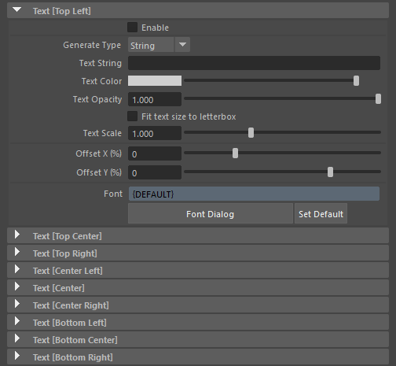
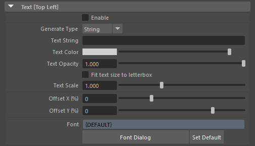
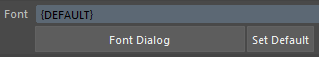

.. _attr_Text_jp:

テキスト
######################

.. contents:: このページの目次:
   :depth: 3
   :local:

++++

概要
*****

* RenderOverrideは、表示させるテキストを自由にカスタマイズすることができます
* 通常の文字列での指定のほかに、PythonやMELコマンドを使った、複雑な情報を表示することもできます

  * 例えば、 ``ls -sl`` というMELのコードを入力すると、シーンで選択しているオブジェクトのリストが表示されます
  * また、RenderOverrideノードのActionsアトリビュートと組み合わせて、アクション情報を表示させることもできます(特にゲームモーション作成時に使える機能になります。(:ref:`sample_Action_jp`))

* 複数行の表示が可能です
* 文字のフォント、カラー、不透明度、大きさ、表示位置のオフセットを設定することができます
* 日本語を表示させることもできます (フォントが対応していれば)

++++

アトリビュート
**************

テキストのグループ
==================

* ``Text`` グループが9つ用意されています。

  +----------------------+-----------------------------------------------+
  | グループ名           | ResolutionGate内での表示場所 (テキストの整列) |
  +======================+===============================================+
  | Text [Top Left]      | 左上 (左寄せ)                                 |
  +----------------------+-----------------------------------------------+
  | Text [Top Center]    | 上中央 (中央)                                 |
  +----------------------+-----------------------------------------------+
  | Text [Top Right]     | 右上 (右寄せ)                                 |
  +----------------------+-----------------------------------------------+
  | Text [Center Left]   | 左中央 (左寄せ)                               |
  +----------------------+-----------------------------------------------+
  | Text [Center]        | 中央 (中央)                                   |
  +----------------------+-----------------------------------------------+
  | Text [Center Right]  | 右中央 (右寄せ)                               |
  +----------------------+-----------------------------------------------+
  | Text [Bottom Left]   | 左下 (左寄せ)                                 |
  +----------------------+-----------------------------------------------+
  | Text [Bottom Center] | 下中央 (中央)                                 |
  +----------------------+-----------------------------------------------+
  | Text [Bottom Right]  | 右下 (右寄せ)                                 |
  +----------------------+-----------------------------------------------+

* 表示位置ごとに、テキストを設定することができます
* 表示させるポジションの基準は、ResolutionGateになります

++++

各グループ内のアトリビュート
============================

* 各グループ内のアトリビュートの構成は同じになっています

(各アトリビュートの概要)

+----------------------------+-----------------------------------------------------------------------------------------------+
| アトリビュート             | 概要                                                                                          |
+============================+===============================================================================================+
| Enable                     | 各グループごとに有効/無効を切り替えることができます                                           |
+----------------------------+-----------------------------------------------------------------------------------------------+
|| Generate Type             || ``Text String`` アトリビュートに記述した文字をそのまま表示させる時は" **String** "にします。 |
||                           || スクリプトを実行させたいときは、" **Python** "や" **MEL** "を選択します。                    |
+----------------------------+-----------------------------------------------------------------------------------------------+
| Text String                | 表示させたい文字を入力します。スクリプトを実行させたいときは、コードを記述します。            |
+----------------------------+-----------------------------------------------------------------------------------------------+
| Text Color                 | テキストのカラー                                                                              |
+----------------------------+-----------------------------------------------------------------------------------------------+
| Text Opacity               | テキストの不透明度(0.0: 透明, 1.0: 不透明)                                                    |
+----------------------------+-----------------------------------------------------------------------------------------------+
| Fit text size to letterbox | 文字の大きさを :ref:`attr_Letterbox_jp` の大きさに合わせます。                                |
+----------------------------+-----------------------------------------------------------------------------------------------+
| Text Scale                 | 自動計算されたテキストサイズに対し、スケールを掛けます。                                      |
+----------------------------+-----------------------------------------------------------------------------------------------+
| Offset X (%)               | 横軸のオフセット値。 ResolutionGateの幅に対し、オフセットの割合を指定します。                 |
+----------------------------+-----------------------------------------------------------------------------------------------+
| Offset Y (%)               | 縦軸のオフセット値。 ResolutionGateの高さに対し、オフセットの割合を指定します。               |
+----------------------------+-----------------------------------------------------------------------------------------------+
| Font                       | フォントを設定します。**Font Dialog** / **Set Default** ボタンから編集を行います。            |
+----------------------------+-----------------------------------------------------------------------------------------------+

++++

Enable
------

* 各ポジションのテキストを、個別にon/offさせることができます
* 文字が表示されない時は、このアトリビュートがonになっているか確認してください

Generate Type
-------------

* **String**

  * ``Text String`` アトリビュートに記述した文字をそのまま表示させる時は" **String** "を選択します

* **Python**

  * Pythonコードを実行させたいときは" **Python** "を選択します
  * 外部ファイル(.pyなど)を実行させたいときは、予め ``PYTHONPATH`` を通しておくなど、対応が必要です

* **MEL**

  * MELコードを実行させたいときは" **MEL** "を選択します
  * 外部ファイル(.mel)を実行させたいときは、Mayaが認識できるように環境を整えてください

Text String
-----------

* 表示させる文字や、実行させるコードを記述します

(Generate Typeが **String** の場合)
^^^^^^^^^^^^^^^^^^^^^^^^^^^^^^^^^^^

* 表示させたい文字を入力します
* 改行する時は、改行コード( ``\n`` )を行間に挿入します

  * 例: ``1行目\n2行目``
  * ``\`` (バックスラッシュ)は、日本語キーボードの場合は" ``￥`` (円マーク/半角)"のキーを押下してください

* 予め用意されているキーワード(変数)を波カッコ( ``{}`` )で囲って入力すると、値を置き換えて表示されます

  * 例: ``{FOCAL_LENGTH}`` => ``35.0``

* キーワードと通常の文字列を組み合わせることもできます

  * 例: ``{FOCAL_LENGTH}mm`` => ``35.0mm``

* 表示オプション(波カッコの中の、コロンの後の書式)を使うと、"小数点の桁数を揃える"など、出力を制御できます

  * 例: ``{FOCAL_LENGTH:.3f}`` => ``35.000`` (小数点を3桁に揃える)
  * 表示オプションは `Pythonの文字format`_ に準拠しています

(キーワード (変数)と意味)

+-------------------+----------------------------------------------------------+------------------------+
| キーワード (変数) | 意味                                                     | 置き換わる値(例)       |
+===================+==========================================================+========================+
| ANIM_START_TIME   | アニメーションの開始時間                                 | 1.0                    |
+-------------------+----------------------------------------------------------+------------------------+
| ANIM_END_TIME     | アニメーションの終了時間                                 | 48.0                   |
+-------------------+----------------------------------------------------------+------------------------+
| MIN_TIME          | 再生のタイムレンジの開始時間                             | 5.0                    |
+-------------------+----------------------------------------------------------+------------------------+
| MAX_TIME          | 再生のタイムレンジの終了時間                             | 24.0                   |
+-------------------+----------------------------------------------------------+------------------------+
| CUR_TIME          | 現在の時間                                               | 10.0                   |
+-------------------+----------------------------------------------------------+------------------------+
| SCENE_NAME        | Mayaファイル名(ファイルが保存されていなければ"Untitled") | PRJ_ChrA_model_v001.ma |
+-------------------+----------------------------------------------------------+------------------------+
| CAM_NAME          | ビューのカメラ名                                         | persp                  |
+-------------------+----------------------------------------------------------+------------------------+
| FOCAL_LENGTH      | カメラの焦点距離                                         | 35.0                   |
+-------------------+----------------------------------------------------------+------------------------+
| USER              | マシンにログインしているユーザー名                       | JohnSmith              |
+-------------------+----------------------------------------------------------+------------------------+
| DATE_JP           | 本日の日付(日本式フォーマット)                           | 2022/04/25             |
+-------------------+----------------------------------------------------------+------------------------+
| DATE_US           | 本日の日付(アメリカ式フォーマット)                       | Apr 25, 2022           |
+-------------------+----------------------------------------------------------+------------------------+
| DATE_UK           | 本日の日付(イギリス式フォーマット)                       | 14 Apr 2022            |
+-------------------+----------------------------------------------------------+------------------------+

(キーワード、文字、表示オプション( `Pythonの文字format`_ )の組み合わせ例)

+---------------------------------------------------------+--------------------------+----------------------------------------------------------------------------------------------+
| アトリビュートに入力する値                              | 出力例                   | 備考                                                                                         |
+=========================================================+==========================+==============================================================================================+
|| ``[{MIN_TIME:.0f} - {MAX_TIME:.0f}] {CUR_TIME:03.0f}`` || ``[1 - 48] 005``        || 再生のタイムレンジの"開始/終了時間"と、現在のフレームを表示します。                         |
||                                                        ||                         || キーワードの後の ``:.0f`` で、小数点部分を取り除くことができます("小数点部分を0桁にする")。 |
||                                                        ||                         || キーワードの後の ``:03.0f`` で、小数点部分を取り除き、整数部分を3桁にすることができます。   |
+---------------------------------------------------------+--------------------------+----------------------------------------------------------------------------------------------+
| ``Focal Length: {FOCAL_LENGTH:.1f}mm``                  | ``Focal Length: 35.0mm`` | 焦点距離を、小数点1桁で( ``:.1f`` )表示させます                                              |
+---------------------------------------------------------+--------------------------+----------------------------------------------------------------------------------------------+

(Generate Typeが **Python** , **MEL** の場合)
^^^^^^^^^^^^^^^^^^^^^^^^^^^^^^^^^^^^^^^^^^^^^

* 外部のPythonスクリプトを実行させる時は、次のように記述します( ``PYTHONPATH`` などを通して、Mayaが認識できるようにしておいてください)

  .. code-block:: python

     import renderoverride_actions;renderoverride_actions.actions_text()

  * Pythonスクリプトを活用した例は、 :ref:`こちら<sample_Action_jp>` で紹介しています

* MELコマンドを直接実行する場合は、次のように記述します

  .. code-block:: C++

     ls -selection

  * 選択されているオブジェクトのリストが表示されます

(右クリックからプリセットを適用する)
^^^^^^^^^^^^^^^^^^^^^^^^^^^^^^^^^^^^

* テキストボックス上で右クリックすると、メニューが表示されます
* いずれかのプリセットを選択すると、 ``Generate Type`` と ``Text String`` のアトリビュートが更新されます

  .. figure:: ../../_images/textRightClick.png
     :alt: textRightClick

Text Color
----------

* テキストのカラーを設定します

  .. note::
     カラーを変更しても、すぐにビューの表示は更新されません。これは、アトリビュートエディタの問題です(ColorのUIを更新したときに、ビューのリフレッシュが行われない)。その為、更新結果を確認したい場合は、カラーを設定した後にShelfの"Refresh"ボタンを押して、ビューをリフレッシュさせてください。

     .. figure:: ../../_images/shelf_refresh_icon.png
        :alt: shelfRefresh

Text Opacity
------------

* テキストの不透明度を設定します

Fit text size to letterbox
--------------------------

* テキストのサイズを、:ref:`attr_Letterbox_jp` の高さに合うように調整します

  .. figure:: ../../_images/textFitLine1.png
     :alt: textFitLine1

* テキストが複数行の場合は、全ての行がLetterbox内に収まるように調整されます

  .. figure:: ../../_images/textFitLine2.png
     :alt: textFitLine2

* ※テキストは10px以上を保とうとする為、Letterboxの高さが十分でない場合は、はみ出すことがあります

  .. figure:: ../../_images/textFitLine3.png
     :alt: textFitLine3

Text Scale
----------

* 自動計算されたテキストサイズに対し、スケールを掛けます

  * デフォルトでは、テキストのサイズはResolutionGateの高さに応じて自動計算されます
  * ``Fit text size to letterbox`` アトリビュートがonになっている場合は、Letterboxの高さに応じてテキストのサイズを自動計算します

* スケールを掛けた結果、テキストのサイズが10pxを下回った場合は、10pxに固定されます

Offset X (%)
------------

* 自動計算されたポジションから、横軸にオフセットさせる割合を指定します

  * ResolutionGateの幅を基準に計算されます

Offset Y (%)
------------

* 自動計算されたポジションから、縦軸にオフセットさせる割合を指定します

  * ResolutionGateの高さを基準に計算されます

Font
-----

* フォントを設定します
* フォントファミリー、太さ、イタリック、下線の表示などを指定できます
* 直接編集できないようになっているので、**Font Dialog**/**Set Default** ボタンから編集を行います

  * **Font Dialog** ボタン

    * FontDialogが表示されます

        .. figure:: ../../_images/textFontDialog.png
           :alt: textFontDialog

    * このダイアログで、 ``Font``, ``Font style``, ``Strikeout``, ``Underline`` を設定します

      .. warning::
         * **Size** は適用されません

           * (ResolutionGateの高さに応じて自動計算されるため)
           * テキストのサイズは、自動計算されたサイズに ``Text Scale`` の値を掛けて調整してください

         * **Strikeout** (打消し線)と **Underline** (下線)は同時に使えません

           * 両方チェックを入れた場合は、 **Underline** が優先されます

  * **Set Default** ボタン

    * Mayaデフォルトのフォントに設定します

.. _Pythonの文字format: https://docs.python.org/ja/3.10/tutorial/inputoutput.html

