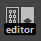

.. _shelf_jp:

Shelf
#####

.. contents:: このページの目次:
   :depth: 3
   :local:

++++

概要
*****

* RenderOverrideのプラグインが正常にロードされると、"RenderOverride"のShelfが自動的に読み込まれます
* 次のようなShelfが読み込まれていることを確認してください

  .. figure:: ../../_images/shelf_all.png
     :alt: Shelf

++++

各ツールの説明
**************

1. Node Editor
==============

* RenderOverrideノードの作成や、アクティブなノードの切り替えなどでこのツールを使います

  * アイコンをクリックすると、次のようなウィンドウが開きます

    .. figure:: ../../_images/NodeEditorAll.png
       :alt: NodeEditorAll

    1. **ノードのリスト**

       * Maya®シーンに存在するRenderOverrideノードのリストが表示されます
       * 各項目のチェックボックスは、 ``Enable`` アトリビュートの **on** / **off** を表しています
       * リストをクリックすると、そのノードが選択され、アクティブになります

         * (選択したノードの ``Enable`` アトリビュートが **on** になり、その他のノードは **off** になります)

    2. **Create RenderOverride Node**

       * RenderOverrideノードを作成します
       * 作成されたノードがアクティブになります

    3. **Delete Selected Node**

       * UIで選択されているノードを削除します

    4. **Refresh the scene and UI**

       * Maya®のシーンをリフレッシュし、UIを最新の状態に更新します

    5. **Close**

       * ウィンドウを閉じます

2. Refresh
==========

* ビューをリフレッシュします

  * RenderOverrideノードのアトリビュートを変更しても表示が更新されない場合は、このボタンをクリックし、画面をリフレッシュしてください

3. Help
=======

* Webブラウザで、オンラインドキュメントを開きます
